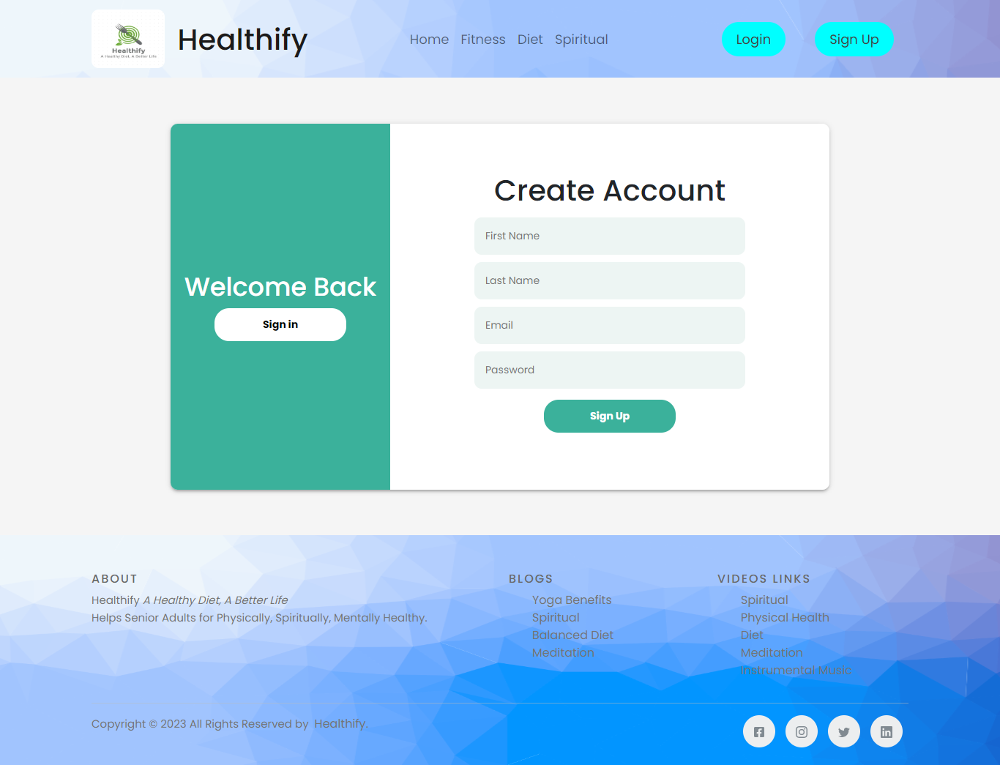
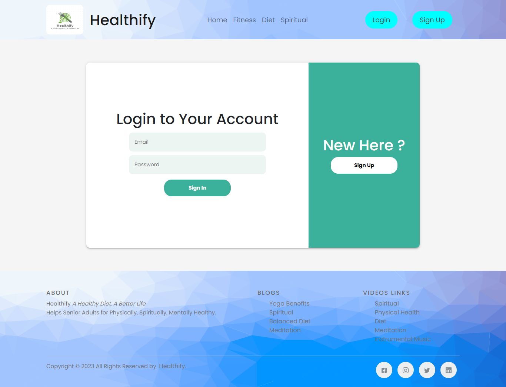

# Healthify Web Application

## Problem Statement

Identify one use case for elderly care (for the age group 65+) and create a working prototype to demonstrate
your idea using technology known to you.

 

## Introduction

Creating a **Healthify Web Application** for the elderly care (for the age group 65+). This project is built using
ReactJS, MongoDB, Express, Nodejs. It consists of various section such as Home, Fitness, Diet, Spiritual WellBeing.
This Application can help senior adults to be Physically, Mentally Healthy. 

## 🔗 Important Links

> ## Checkout the Website [Web Application](https://healthify-app-front-end.vercel.app/)
> ## Backend API [Healthify Backend API](https://healthify-app-backend.onrender.com/)

 

## 🔗 APIs Used

> ##  Extnernal API [Calorie Ninjas](https://calorieninjas.com/api)
> ##  Backend API [Healthify Backend API](https://documenter.getpostman.com/view/9062378/2s93m8yfS3)

 

## Features

- **Sign Up**

 User can able to create his/her new account if it doesn't exists earlier. Details required to create a new account are firstName, lastName, email, password.

- **Sign In**

 User can able to login to the existing account by entering the details such as email, password.

- **Home Page**

 Home Page will introduce with the importance of Physical, Mental, Balanced Diet for the senior adults.

- **Fitness Section**

Fitness Section consists of yoga exercises which will help senior adults to be physically active. It can be categorized into 3 sections: Sitting Yoga Poses, Standing Yoga Poses, Lying Yoga Poses. This Page will list all the Yoga Poses based on the 3 categories Sitting, Standing, Lying.

- **Get Specific Yoga Pose Details**

This section will provide the details of specific yoga pose. It consists of Specific Yoga Posename, Image, Duration, Relxation Time, Youtube Link to practically see how to perform the particular Yoga Pose.

- **Balanced Diet Section**

In balanced diet section we can able to search the food item and see the nutrients details such as calories, carbs, Cholestrol, Saturated Fats, Total fats, Fibre, Protein, Pottasium. By searching the food item Senior adults will know the calories and nutrients details of it.

- **Spiritual Section**

Spiritual Section is focused on how to be Mentally Healthy. It section comprises of Recommended Spiritual Youtube videos such as Gita Course By Amogh Lila Prabhu, Mind Management By Swami Mukudananda and many more. Along with that it consist of the Recommended Spiritual Books such as Bhagwad Gita As It Is By AC Bhaktivedant Swami Shrila Prabhupada, Power of Throughts by Swami Mukudananda as many more. Senior Adults can view videos and read books to be Mentally Healthy.

# Getting Started with Create React App

This project was bootstrapped with [Create React App](https://github.com/facebook/create-react-app).

## Available Scripts

In the project directory, you can run:

### `npm start`

Runs the app in the development mode.\
Open [http://localhost:3000](http://localhost:3000) to view it in your browser.

The page will reload when you make changes.\
You may also see any lint errors in the console.

### `npm test`

Launches the test runner in the interactive watch mode.\
See the section about [running tests](https://facebook.github.io/create-react-app/docs/running-tests) for more information.

### `npm run build`

Builds the app for production to the `build` folder.\
It correctly bundles React in production mode and optimizes the build for the best performance.

The build is minified and the filenames include the hashes.\
Your app is ready to be deployed!

See the section about [deployment](https://facebook.github.io/create-react-app/docs/deployment) for more information.

### `npm run eject`

**Note: this is a one-way operation. Once you `eject`, you can't go back!**

If you aren't satisfied with the build tool and configuration choices, you can `eject` at any time. This command will remove the single build dependency from your project.

Instead, it will copy all the configuration files and the transitive dependencies (webpack, Babel, ESLint, etc) right into your project so you have full control over them. All of the commands except `eject` will still work, but they will point to the copied scripts so you can tweak them. At this point you're on your own.

You don't have to ever use `eject`. The curated feature set is suitable for small and middle deployments, and you shouldn't feel obligated to use this feature. However we understand that this tool wouldn't be useful if you couldn't customize it when you are ready for it.

## Learn More

You can learn more in the [Create React App documentation](https://facebook.github.io/create-react-app/docs/getting-started).

To learn React, check out the [React documentation](https://reactjs.org/).

### Code Splitting

This section has moved here: [https://facebook.github.io/create-react-app/docs/code-splitting](https://facebook.github.io/create-react-app/docs/code-splitting)

### Analyzing the Bundle Size

This section has moved here: [https://facebook.github.io/create-react-app/docs/analyzing-the-bundle-size](https://facebook.github.io/create-react-app/docs/analyzing-the-bundle-size)

### Making a Progressive Web App

This section has moved here: [https://facebook.github.io/create-react-app/docs/making-a-progressive-web-app](https://facebook.github.io/create-react-app/docs/making-a-progressive-web-app)

### Advanced Configuration

This section has moved here: [https://facebook.github.io/create-react-app/docs/advanced-configuration](https://facebook.github.io/create-react-app/docs/advanced-configuration)

### Deployment

This section has moved here: [https://facebook.github.io/create-react-app/docs/deployment](https://facebook.github.io/create-react-app/docs/deployment)

### `npm run build` fails to minify

This section has moved here: [https://facebook.github.io/create-react-app/docs/troubleshooting#npm-run-build-fails-to-minify](https://facebook.github.io/create-react-app/docs/troubleshooting#npm-run-build-fails-to-minify)

## Tools Used

 

## Library Used
- reactJs
- react-router-dom
- react-axios
- react-bootstrap
- react-icons
- sass
- sweetalert2
- dotenv
- express
- mongoose
- nodemon

- Framework: ExpressJS, Bootstrap
- Database: MongoDB
- Version Control System: Git
- VCS Hosting: GitHub
- Programming / Scripting: Vanilla JavaScript
- Front-End: SCSS, EJS
- Runtime Environment: NodeJS
- Integrated Development Environment: VSCode

## Screens

## Sign Up 

### Sign In

### Home Page

### Fitness Page

### Display List of all Yoga Poses Based on Category

### Display Specific Yoga Pose

### Diet Section

### Spiritual Section

